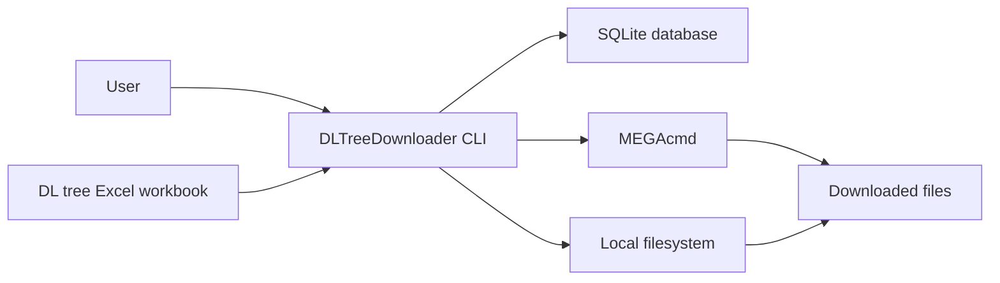

# System Context

## 1. 系统定位

DLTreeDownloader 是运行在用户本机的命令行程序。它不负责维护远程数据源，也不保存 MEGA 登录凭据；它只消费用户提供的 Excel 工作簿和本机已有的 MEGAcmd 登录状态。

系统核心职责：

- 从 Excel 工作簿导入作品、人员、社团和下载链接信息。
- 在本地 SQLite 数据库中维护可查询数据和下载链接历史。
- 提供按作品编码、声优、社团查询的 CLI。
- 在下载前估算所需空间并调用 MEGAcmd 执行下载。

## 2. 外部参与者

| 参与者 | 关系 |
|---|---|
| 用户 | 通过命令行执行初始化、导入、查询、下载和诊断命令。 |
| Excel 工作簿 | 用户手动提供的数据源，格式预计稳定但内容会更新。 |
| SQLite 数据库 | 本地持久化存储，由程序创建和维护。 |
| 文件系统 | 保存配置、数据库、下载文件，并提供磁盘空间信息。 |
| MEGAcmd | 外部下载工具，程序通过命令行调用。 |

## 3. 系统边界

## 4. 输入输出

主要输入：

- Excel 文件路径。
- 作品编码。
- 声优或社团搜索关键词。
- 下载目录和下载选项。
- `env/config.toml` 中的本地配置。

主要输出：

- SQLite 数据库。
- CLI 查询结果。
- 导入统计和错误记录。
- 下载文件。
- 下载记录和诊断结果。

## 5. 约束

- 目标平台优先支持 Windows。
- v1 不提供 GUI。
- v1 不做自动定时导入。
- v1 不管理 MEGA 账号凭据。
- v1 不做多用户并发访问设计。
- 下载链接以 Excel 中的 MEGA JSON 为准，历史旧链接保留但默认隐藏。

## 6. 关键假设

- 工作簿表头名称稳定。
- `MEGA链接` 列可解析为 JSON，异常行需要记录而不是导致所有导入静默失败。
- MEGAcmd 已由用户单独安装，并且相关命令位于 PATH 或配置指定路径。
- SQLite 单文件数据库足以支撑当前约 7.5 万作品规模。

