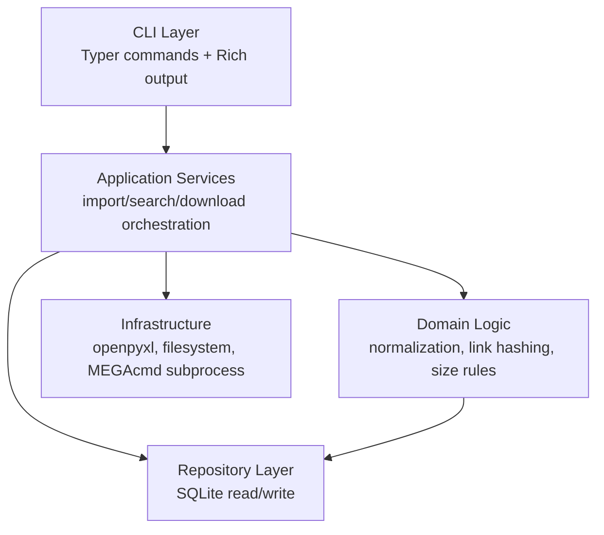

# Architecture

## 1. 架构风格

系统采用本地单进程 CLI 架构：

- CLI 层负责命令解析、参数校验和结果展示。
- 应用服务层负责用例编排。
- 领域/数据处理层负责导入、搜索、下载校验等核心规则。
- 基础设施层负责 SQLite、文件系统、Excel 读取和 MEGAcmd 调用。

该架构避免引入后台服务，部署和排错成本低，适合本项目的单机批处理和本地查询场景。

## 2. 分层结构



## 3. 推荐模块

| 模块 | 主要职责 |
|---|---|
| `dltree.cli` | 定义命令、参数、退出码和用户可见输出。 |
| `dltree.config` | 读取、创建和解析 `env/config.toml`。 |
| `dltree.db` | 建立 SQLite 连接，初始化 schema，提供事务边界。 |
| `dltree.importer` | 读取 Excel、校验表头、逐行导入、生成导入统计。 |
| `dltree.models` | 定义内部数据结构，如 Work、LinkItem、ImportStats。 |
| `dltree.search` | 封装作品编码、声优、社团查询。 |
| `dltree.mega` | 检查 MEGAcmd、登录状态，并调用 `mega-get`。 |
| `dltree.sizes` | 解析展示尺寸，计算下载所需空间和安全余量。 |

## 4. 依赖方向

依赖应尽量单向：

```text
cli -> application services -> domain helpers/repositories -> infrastructure
```

约束：

- `cli` 不直接拼接 SQL。
- `importer` 不直接处理 Rich 表格展示。
- `mega` 不访问 Excel 或导入逻辑。
- `db` 不调用 MEGAcmd。

这样后续测试可以分别 mock 数据库、MEGAcmd 和文件系统边界。

## 5. 配置结构

默认配置文件：

```text
env/config.toml
```

建议由 `dltree init` 或 `setup_env.ps1` 创建：

```toml
[paths]
database = "env/dltree.sqlite3"
downloads = "downloads"

[download]
safety_margin_percent = 5
safety_margin_min_mb = 512
include_par2_by_default = false

[mega]
mega_get = "mega-get"
mega_whoami = "mega-whoami"
```

## 6. 错误处理原则

- 用户输入错误：显示清晰提示并返回非零退出码。
- 导入行级错误：记录到 `import_errors`，继续处理后续行。
- 导入硬错误：回滚事务，标记导入失败。
- 下载前置检查失败：停止下载，不调用 `mega-get`。
- MEGAcmd 执行失败：记录退出码和摘要信息到下载记录。

## 7. 退出码建议

| 场景 | 退出码 |
|---|---:|
| 成功 | 0 |
| 参数或配置错误 | 2 |
| 目标记录不存在 | 3 |
| 外部依赖不可用 | 4 |
| 磁盘空间不足 | 5 |
| 导入或下载执行失败 | 10 |

