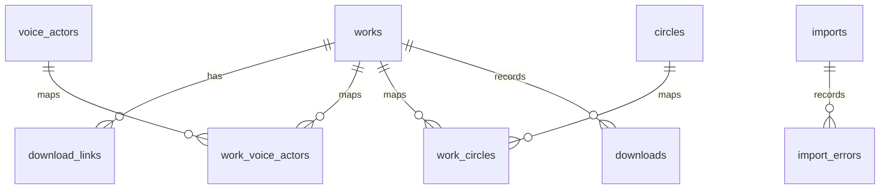
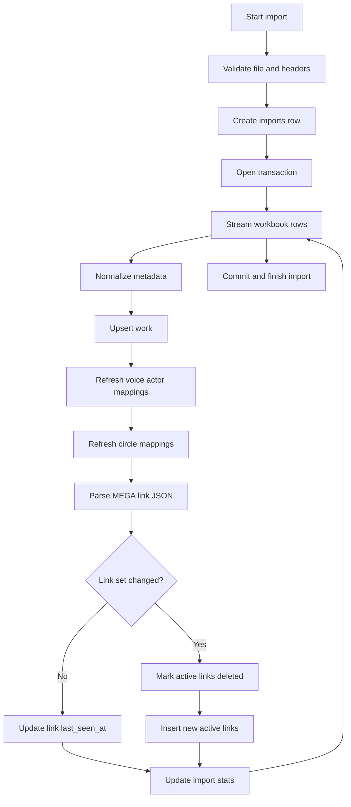

# Data And Import Design

## 1. 数据模型概要

数据库以作品为中心组织数据：



核心表：

- `works`：作品主信息，一条作品一行。
- `download_links`：活动和历史下载链接。
- `voice_actors` / `work_voice_actors`：声优规范化查询。
- `circles` / `work_circles`：社团规范化查询。
- `imports` / `import_errors`：导入审计和错误排查。
- `downloads`：下载请求和执行结果记录。

## 2. 字段命名策略

Excel 中的 `RJcode` 不只包含 RJ 编码，因此程序内部统一使用 `work_code`。

导入映射：

| Excel 列 | 内部字段 |
|---|---|
| `RJcode` | `work_code` |
| `标签` | `tags_raw` |
| `MEGA链接` | `download_links` |
| `销售日期` | `sale_date` |
| `声优` | `voice_actor_raw` + normalized mappings |
| `标题` | `title` |
| `备注` | `note` |
| `类型` | `work_type` |
| `社团` | `circle_raw` + normalized mappings |
| `档案大小` | `archive_size_raw` / `archive_size_bytes` |
| `MP3大小` | `mp3_size_raw` / `mp3_size_bytes` |

## 3. 导入流程



## 4. 导入一致性策略

### 作品 upsert

以 `work_code` 为唯一键：

- 新作品：插入 `works`、关联声优、关联社团、插入活动链接。
- 已存在作品：更新元数据和 `last_seen_at`，刷新声优与社团映射。
- 已存在且链接未变化：不重复插入下载链接。
- 已存在且链接变化：旧活动链接标记为 `is_deleted = 1`，新链接作为活动链接插入。

### 下载链接历史

普通查询只展示 `is_deleted = 0` 的活动链接。旧链接保留在数据库中，用于追踪工作簿更新带来的链接变化。

链接集合变化检测采用稳定哈希：

```text
sha256(sorted(link_group, link_order, file_name, mega_url, size_bytes))
```

比较对象是同一作品的完整活动链接集合，而不是单条 URL。

## 5. 数据规范化

文本规则：

- 去除首尾空白。
- 空字符串和字面量 `null` 转为 SQL null。
- 保留原始文本字段，避免解析策略造成信息损失。

声优规则：

- 优先按连续两个及以上空格拆分。
- 可兼容 `、`、`，`、`,`。
- 去重、去空、保留原始 `voice_actor_raw`。

社团规则：

- v1 将整个 `社团` 单元格视为一个社团名。
- 不按 `/`、`&` 或标点拆分。

链接规则：

- 支持 JSON 根分组，当前观察到为 `C`。
- 每个链接项读取 `F`、`L`、`S`。
- `S` 必须解析为整数 byte 数。
- JSON 异常或关键字段异常时记录行级错误。

## 6. 事务策略

v1 使用单个导入事务：

- 成功时一次性提交。
- 硬错误时回滚。
- 行级错误写入 `import_errors`，不阻断整个导入。

该策略优先保证一致性。若后续导入速度或锁时间成为问题，再评估批量提交。

## 7. 查询性能策略

必需索引：

- `works(work_code)`
- `works(is_deleted)`
- `download_links(work_id, is_deleted)`
- `voice_actors(name_normalized)`
- `circles(name_normalized)`

FTS5 可作为后续增强，不作为 v1 必需能力。

