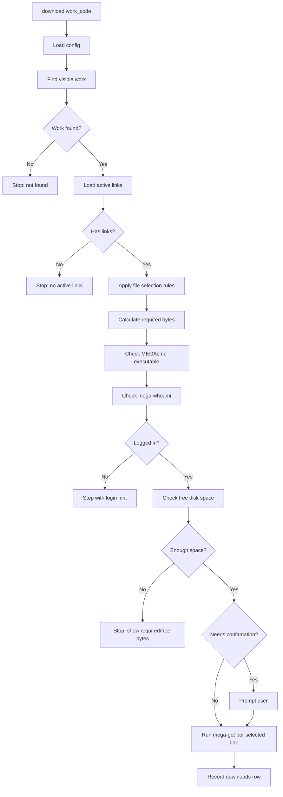

# CLI And Download Runtime Design

## 1. CLI 命令概要

v1 命令集：

```text
dltree init
dltree import <xlsx_path>
dltree search-code <work_code>
dltree search-voice <name>
dltree search-circle <name>
dltree info <work_code>
dltree download <work_code> [--output <dir>] [--include-par2] [--yes]
dltree doctor
```

后续可扩展：

```text
dltree list-downloads
dltree config get <key>
dltree config set <key> <value>
dltree stats
```

## 2. 命令职责

| 命令 | 职责 |
|---|---|
| `init` | 创建配置、数据库和默认下载目录，可重复执行。 |
| `import` | 从 Excel 导入或刷新本地数据库。 |
| `search-code` | 按作品编码精确查询。 |
| `search-voice` | 按声优名称模糊查询相关作品。 |
| `search-circle` | 按社团名称模糊查询相关作品。 |
| `info` | 展示单个作品的元数据和活动下载链接。 |
| `download` | 完成前置检查后调用 MEGAcmd 下载。 |
| `doctor` | 检查 Python、数据库、配置、MEGAcmd 和登录状态。 |

## 3. 查询显示原则

- 查询结果优先显示 `work_code`，便于复制后执行 `info` 或 `download`。
- 缺失字段显示为空或 `-`，不抛出异常。
- 声优和社团搜索默认限制结果数量，建议默认 50 条并支持 `--limit`。
- 详情页展示活动链接数量和总 byte 数，帮助用户判断下载规模。

## 4. 下载流程



## 5. 文件选择规则

建议 v1 默认行为：

- 默认排除 `.par2` 文件。
- 用户传入 `--include-par2` 时包含 `.par2` 文件。
- 配置 `include_par2_by_default = true` 可改变默认值。
- 下载前展示将要下载的文件数量、总大小、是否排除了 `.par2`。

这样可降低默认下载体积，同时保留完整下载选项。

## 6. 磁盘空间规则

所需空间：

```text
sum(selected active link size_bytes) + max(selected_bytes * 5%, 512 MB)
```

配置可覆盖：

- `download.safety_margin_percent`
- `download.safety_margin_min_mb`

检查目录规则：

- 若输出目录存在，检查该目录所在磁盘。
- 若输出目录不存在，查找最近存在的父目录。
- 只有前置校验通过后才创建输出目录。

## 7. MEGAcmd 集成

程序通过外部进程调用 MEGAcmd：

```text
mega-whoami
mega-get <mega_url> <output_dir>
```

设计要求：

- 不通过 shell 拼接命令。
- 捕获退出码、标准输出和错误摘要。
- 下载前先执行 `mega-whoami`，让登录状态失败更早、更清晰。
- 若未登录，提示用户手动完成 MEGAcmd 登录。

## 8. 下载记录

每次下载请求写入 `downloads`：

- 作品 ID。
- 请求时间。
- 输出目录。
- 选中文件总大小。
- 下载前可用空间。
- 状态。
- MEGAcmd 退出码。
- 摘要消息。

下载记录用于排查失败原因，也便于后续添加 `list-downloads`。

## 9. 确认策略

建议默认在真正调用 `mega-get` 前要求确认，除非用户传入 `--yes`。

确认内容：

- 作品编码和标题。
- 输出目录。
- 文件数量。
- 预计下载大小。
- 额外安全余量。
- 可用磁盘空间。

