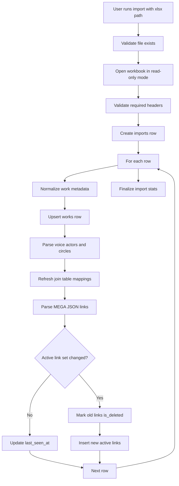
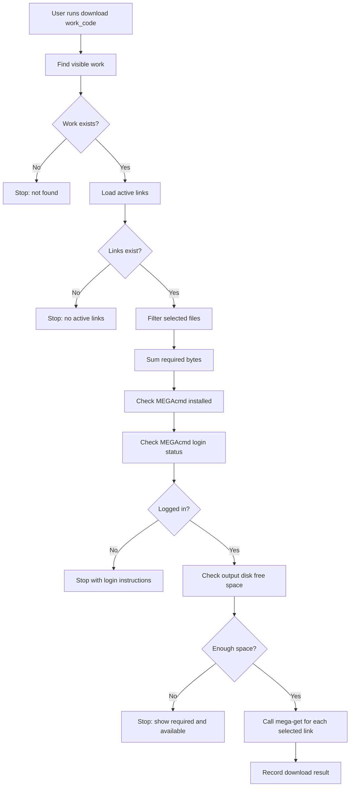

# CLI And Process Flows

## 1. CLI Principles

The program is a local CLI, so commands should be predictable and recoverable:

- Never download before confirming the work exists.
- Never download before checking active link sizes and free disk space.
- Never hide import errors; summarize them and store details in the database.
- Prefer exact `work_code` lookup for downloads.
- Use fuzzy or partial matching for voice actor and circle search.

## 2. Proposed Command Set

```text
dltree init
dltree import <xlsx_path>
dltree search-code <work_code>
dltree search-voice <name>
dltree search-circle <name>
dltree info <work_code>
dltree download <work_code> [--output <dir>] [--include-par2] [--yes]
dltree doctor
```

Optional later commands:

```text
dltree list-downloads
dltree config get <key>
dltree config set <key> <value>
dltree stats
```

## 3. Import Flow



Import result should display:

- Total rows scanned.
- New works inserted.
- Existing works updated.
- Works skipped because unchanged.
- Link sets changed.
- Import errors.
- Database path.

## 4. Search By Work Code

Input:

```text
dltree search-code RJ01548502
```

Process:

1. Normalize input by trimming whitespace.
2. Query `works` where `work_code = ?` and `is_deleted = 0`.
3. If found, show compact metadata:
   - Work code
   - Title
   - Sale date
   - Circle
   - Voice actors
   - Archive size
   - Active link count
   - Total active link bytes
4. If not found, say no local record exists and suggest importing the latest workbook.

## 5. Search By Voice Actor

Input:

```text
dltree search-voice 柚木つばめ
```

Process:

1. Normalize search text.
2. Search `voice_actors.name_normalized LIKE ?`.
3. Join through `work_voice_actors`.
4. Show visible works sorted by sale date descending, then work code descending.

Display columns:

```text
work_code | sale_date | title | circle | archive_size
```

## 6. Search By Circle

Input:

```text
dltree search-circle ホロクサミドリ
```

Process:

1. Normalize search text.
2. Search `circles.name_normalized LIKE ?`.
3. Join through `work_circles`.
4. Show visible works sorted by sale date descending.

## 7. Download Flow



## 8. Disk Space Rule

Required bytes:

```text
sum(selected active link size_bytes) + max(5% of selected bytes, 512 MB)
```

Use Python:

```python
shutil.disk_usage(output_dir).free
```

If the output directory does not exist:

- Check the nearest existing parent directory.
- Create the output directory only after passing basic validation.

## 9. MEGAcmd Handling

MEGAcmd commands are expected to be available on PATH, usually including:

- `mega-whoami`
- `mega-login`
- `mega-get`

Recommended login check:

1. Run `mega-whoami`.
2. If it exits successfully and returns account information, continue.
3. If it fails, tell the user to run `mega-login <email>` or complete MEGAcmd login manually.

Reason:

- The user noted that when MEGAcmd is already logged in, the first direct operation can fail.
- An explicit identity check warms up the MEGAcmd session and makes the failure clearer.

Recommended download call:

```text
mega-get <mega_url> <output_dir>
```

Implementation detail:

- Use `subprocess.run([...], check=False, capture_output=True, text=True)`.
- Do not pass the command through a shell.
- Log exit code and stderr/stdout summary to `downloads.message`.

## 10. PAR2 Handling

Many works have `.par2` files. v1 should make this explicit.

Recommended default:

- Download all non-`.par2` files by default.
- Add `--include-par2` to include `.par2`.
- Show how many `.par2` files were excluded before confirming.

Alternative:

- Download all active files by default for completeness.

This should be decided before implementation.

## 11. Configuration

Recommended config file:

```text
env/config.toml
```

Suggested keys:

```toml
[paths]
database = "env/dltree.sqlite3"
downloads = "downloads"

[download]
safety_margin_percent = 5
safety_margin_min_mb = 512
include_par2_by_default = false

[mega]
mega_get = "mega-get"
mega_whoami = "mega-whoami"
```

## 12. Setup Script

Windows setup script:

```text
setup_env.ps1
```

Responsibilities:

- Create `env` folder.
- Create Python virtual environment at `env/.venv`.
- Install dependencies from `requirements.txt`.
- Create default `env/config.toml` if missing.
- Print next steps:
  - Activate venv.
  - Run `dltree init`.
  - Run `dltree doctor`.

Potential dependencies:

```text
openpyxl
typer
rich
```

Python standard library covers:

- SQLite: `sqlite3`
- Disk usage: `shutil`
- Subprocess: `subprocess`
- Hashing: `hashlib`
- JSON: `json`

