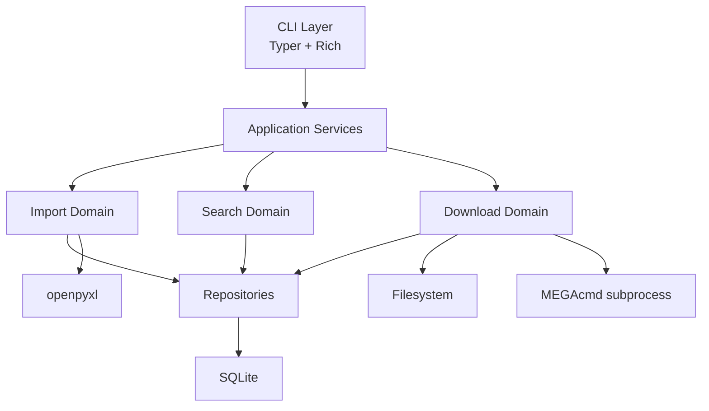

# Architecture

## 1. 分层



## 2. 关键边界

CLI layer：

- 解析命令和参数。
- 展示 Rich 表格。
- 在下载时转发 MEGAcmd 进程输出，让用户能看到实时进度。
- 捕获异常并转换退出码。

Application services：

- 编排一次完整用户操作。
- 控制事务和前置检查顺序。
- 调用 repository、importer、mega、filesystem。

Domain helpers：

- 文本规范化。
- 尺寸解析。
- 链接 JSON 解析。
- 下载文件选择。
- 空间需求计算。

Repositories：

- 数据库读写。
- schema 初始化。
- 导入、查询、下载记录。

Infrastructure：

- Excel 文件读取。
- SQLite 连接。
- 文件系统空间检查。
- MEGAcmd 外部命令调用。

## 3. 为什么保持这些边界

这些边界让二次开发更容易：

- CLI 输出可以改，不影响导入规则。
- 导入规则可以测试，不依赖真实 Excel 全量文件。
- MEGAcmd 可以 mock，不依赖真实账号。
- 查询 SQL 可以优化，不改变命令参数。
- 后续新增 GUI 或 API 时，可复用 application services。

## 4. 数据流

导入：

```text
Excel row -> WorkRow + LinkItem[] -> repositories -> SQLite
```

查询：

```text
CLI query -> search service -> repositories -> result DTO -> Rich table
```

下载：

```text
work_code -> work + active links -> selected links -> checks -> mega-get + streamed output -> downloads row
```

## 5. 不推荐的实现方式

- 在 CLI 中直接写 SQL。
- 在导入函数中打印 Rich 表格。
- 在 repository 中调用 MEGAcmd。
- 在下载前没有检查登录和磁盘空间就创建目录。
- 把 MEGA URL 拼成 shell 字符串执行。
- 为了让解析成功而丢弃 raw 字段。

